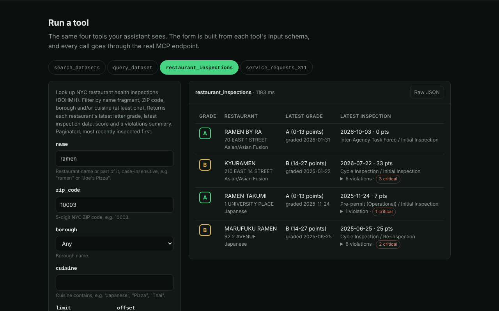

# nyc-open-data-mcp

An [MCP](https://modelcontextprotocol.io) server that gives Claude, Cursor, or any MCP client read-only access to [NYC Open Data](https://opendata.cityofnewyork.us/): 2,400+ city datasets served through the Socrata SODA API. It includes two ready-made tools for the questions people ask most (restaurant health grades and 311 complaints) and two general tools that let the model find and query any other dataset. Inputs are validated, every value placed in a query is escaped, results are paginated and capped in size, upstream errors come back as plain-language hints the model can act on. No API key is required.

It runs two ways: over stdio on your own machine (`npx -y github:frogr/nyc-open-data-mcp`), or as a remote server over Streamable HTTP (the current MCP transport for servers on the web) with a web playground where you can try every tool in a browser. Screenshots of the playground are in [`docs/screenshots/`](docs/screenshots/) and what was verified is in [PROOF.md](PROOF.md).



## What you can ask

> Which ramen spots in 10003 have an A grade?

> What were the top 311 complaints in the East Village last month?

> Are there any restaurants on St. Marks Place with critical violations in their latest inspection?

> Find the dataset for NYC street tree census and tell me the most common species in Brooklyn.

> How did noise complaints in 11211 change between June and August?

## Install

Requires Node.js 20 or newer.

The package is not on npm yet. The commands below install it straight from GitHub with `npx -y github:frogr/nyc-open-data-mcp`: npm clones the repo, installs dependencies and builds it (a `prepare` script runs `npm run build`). The first start takes about 20 seconds while that happens, so run it once in a terminal before adding it to a client. If you'd rather not run a build through npx, use [From source](#from-source).

After the package is published to npm, `npx -y nyc-open-data-mcp` will do the same thing. Until then, don't run that name: nothing has been published under it by this project.

### Claude Desktop

Add this to `claude_desktop_config.json` (macOS: `~/Library/Application Support/Claude/`, Windows: `%APPDATA%\Claude\`), then restart Claude Desktop:

```json
{
  "mcpServers": {
    "nyc-open-data": {
      "command": "npx",
      "args": ["-y", "github:frogr/nyc-open-data-mcp"],
      "env": {
        "SOCRATA_APP_TOKEN": "optional-but-recommended"
      }
    }
  }
}
```

### Claude Code

```bash
claude mcp add --transport stdio nyc-open-data -- npx -y github:frogr/nyc-open-data-mcp

# with an app token, available in every project:
claude mcp add --env SOCRATA_APP_TOKEN=your-token --transport stdio --scope user nyc-open-data -- npx -y github:frogr/nyc-open-data-mcp
```

### Cursor

Add to `~/.cursor/mcp.json` (all projects) or `.cursor/mcp.json` (this project):

```json
{
  "mcpServers": {
    "nyc-open-data": {
      "command": "npx",
      "args": ["-y", "github:frogr/nyc-open-data-mcp"]
    }
  }
}
```

### From source

```bash
git clone https://github.com/frogr/nyc-open-data-mcp && cd nyc-open-data-mcp
npm ci   # also builds dist/ through the prepare script
# then use "command": "node", "args": ["/absolute/path/to/nyc-open-data-mcp/dist/index.js"]
```

### Configuration

| Env var | Default | Purpose |
| --- | --- | --- |
| `SOCRATA_APP_TOKEN` | none | Free [Socrata app token](https://data.cityofnewyork.us/profile/edit/developer_settings). Unauthenticated requests share a small IP-based rate limit; a token raises it a lot. |
| `SOCRATA_TIMEOUT_MS` | `20000` (stdio), `15000` (HTTP) | Per-request timeout. |

The HTTP server also reads `PORT` (3000), `HOST` (0.0.0.0), `RATE_LIMIT_PER_MINUTE` (30), `DAILY_REQUEST_LIMIT` (5000), `MAX_BODY_BYTES` (65536), `REQUEST_TIMEOUT_MS` (30000), `CORS_ORIGINS` (`*`) and `TRUST_PROXY` (0, set to 1 behind one reverse proxy such as Render's). All are listed in [`.env.example`](.env.example).

## Use it remotely

`npm start` runs the HTTP server. It serves:

| Route | What it is |
| --- | --- |
| `POST /mcp` | The MCP endpoint (Streamable HTTP, stateless, JSON responses). `GET` and `DELETE` return 405 because there are no sessions. |
| `GET /` | The playground: example questions, a form for each tool built from its input schema, results as a table or raw JSON, and copy-paste client config. |
| `GET /health` | Status, version, whether an app token is set, and the current limits. Never calls Socrata. |

Once it is deployed (see [Deploy](#deploy)), point a client at `https://<your-host>/mcp`:

```bash
# Claude Code
claude mcp add --transport http nyc-open-data https://<your-host>/mcp
```

```jsonc
// Cursor: ~/.cursor/mcp.json
{ "mcpServers": { "nyc-open-data": { "url": "https://<your-host>/mcp" } } }
```

```jsonc
// Claude Desktop without a custom connector: claude_desktop_config.json, via the mcp-remote bridge
{ "mcpServers": { "nyc-open-data": { "command": "npx", "args": ["-y", "mcp-remote", "https://<your-host>/mcp"] } } }
```

In Claude Desktop or claude.ai you can also add it under Settings > Connectors > Add custom connector, if your plan has custom connectors. To poke at it by hand, run `npx @modelcontextprotocol/inspector`, choose Streamable HTTP and paste the URL.

**Limits on the public endpoint.** These protect the shared Socrata quota and keep one visitor from using it all up.

- Per-IP token bucket on `POST /mcp`, 30 requests per minute by default. A blocked call gets HTTP 429 with `Retry-After`.
- A global cap per UTC day (5000 by default), also 429.
- Request bodies over 64 KB get 413, checked while streaming, so a missing `Content-Length` doesn't get around it.
- Each `/mcp` request has a 30 second wall-clock limit (504), and each Socrata call a 15 second timeout. Slow clients are cut off by Node's header and request timeouts.
- CORS is open (`*`) by default so browser-based clients work. Set `CORS_ORIGINS` to a list to restrict it.
- Internal errors are logged and visitors get a generic message, never a stack trace.
- The limiter lives in memory, so counts reset on restart and are per instance. That is fine for one free-tier instance.

## Tools

| Tool | What it does | Key inputs | Returns |
| --- | --- | --- | --- |
| `restaurant_inspections` | DOHMH restaurant grades ([43nn-pn8j](https://data.cityofnewyork.us/d/43nn-pn8j)) | `name`, `zip_code`, `borough`, `cuisine` (at least one), `limit` ≤ 50, `offset` | Per restaurant: latest grade and what it means, latest inspection date, type, score, and deduplicated violations with critical flags |
| `service_requests_311` | 311 complaint summary ([erm2-nwe9](https://data.cityofnewyork.us/d/erm2-nwe9)) | `zip_codes[]` (≤ 10), `borough`, `complaint_type` (substring), `start_date`, `end_date` (default: last 30 days, max 366), `top_n`, `sample_size` | Total requests, top complaint types with counts and share, remainder count, most recent example requests |
| `search_datasets` | Search the NYC catalog | `query`, `category`, `limit` ≤ 25, `offset`, `include_columns` | Dataset id, name, short description, category, last-updated date, URL, `field:type` column list |
| `query_dataset` | Read-only SoQL against any dataset | `dataset_id`, `select`, `where`, `order`, `group`, `q`, `limit` ≤ 500, `offset` | Rows, `has_more`, `next_offset`, and a note when the results were cut off |

Every tool is marked `readOnlyHint: true` and declares an `outputSchema`. Results come back as JSON text, which works in any client, and as `structuredContent` for clients that use it.

## Design notes

**Why these four tools.** The two specific tools cover the questions people actually ask, and they do the awkward parts on the server. The restaurant dataset stores one row per violation, so the tool first groups by restaurant to page through restaurants, then fetches the history for only that page and works out the latest grade. That grade isn't always from the latest inspection: a re-inspection can leave a grade pending. The 311 dataset has about 22.7 million rows, so the tool runs three small aggregate queries (total, group-by, recent samples) on Socrata's side instead of downloading rows. The two general tools are the fallback for everything else, and `search_datasets` returns column names so the model can write a valid `where` clause on its first try.

**Pagination.** Every list result includes `next_offset`, which is `null` on the last page. `query_dataset` fetches `limit + 1` rows so `has_more` is exact rather than guessed.

**Limits.** `query_dataset` caps `limit` at 500 rows. Each response is also capped at about 60 KB of JSON; when that cap removes rows, the response says so and gives the offset to continue from. 311 date ranges max out at 366 days so queries don't time out upstream. Long descriptions are shortened.

**Safety.**
- Every user value that goes into SoQL (names, ZIPs, complaint types, dates, ids) is passed through `soqlString()`, which doubles single quotes, so `x' OR '1'='1` stays an ordinary string. In "contains" searches, the LIKE wildcards `%` and `_` are removed from user input.
- Dataset ids must match `xxxx-xxxx`. ZIP codes must be 5 digits. Dates must be real `YYYY-MM-DD` dates. Boroughs come from a fixed list.
- Parameters are encoded with `URLSearchParams`, so a `&` inside a clause can't add extra query parameters.
- `query_dataset` passes SoQL clauses through as written, which is the point of that tool. That's safe because the Socrata endpoint is read-only public data and the tool can only send GET requests to `/resource/{id}.json`.

**Rate limits and reliability.**
- Every request has a timeout.
- 429 and 5xx responses are retried up to 2 times with exponential backoff, following `Retry-After` up to 5 seconds.
- Identical requests are cached in memory for 60 seconds, so an agent that asks the same thing again doesn't send another request.
- An optional app token raises the rate limit.

**Errors.** Upstream failures are mapped to tool errors (`isError: true`) that say what went wrong and what to try next, for example:

```
Dataset 'zzzz-zzzz' was not found on data.cityofnewyork.us. (HTTP 404, dataset.missing)
Hint: Use search_datasets to find a valid dataset id (format: xxxx-xxxx).
```

## Deploy

The HTTP server needs no database and no secrets. A free tier is enough.

**Render** (free web service; [Render](https://render.com) is a hosting platform that reads `render.yaml` from the repo):

1. Push this repo to GitHub.
2. In Render: New > Blueprint, pick the repo. It reads `render.yaml` (plan `free`, build `npm ci && npm run build`, start `npm start`, health check `/health`, `TRUST_PROXY=1`).
3. Optional: set `SOCRATA_APP_TOKEN` when Render asks for it (it is marked `sync: false`, so it is never stored in the repo).
4. Open `https://<service>.onrender.com/` for the playground. The MCP URL is the same host plus `/mcp`.

Free Render services sleep after a while without traffic, so the first request after a quiet spell takes longer.

**Docker** (any host that runs containers):

```bash
docker build -t nyc-open-data-mcp .
docker run -p 3000:3000 -e TRUST_PROXY=1 nyc-open-data-mcp
```

**Anywhere with Node 20+:**

```bash
npm ci && npm run build
PORT=3000 npm start
curl localhost:3000/health
```

## Development

```bash
npm install
npm test          # vitest, recorded fixtures only, no network
npm run build     # compiles to dist/
npm run smoke     # spawns the server over stdio, runs initialize + tools/list
node scripts/smoke.mjs --live   # also makes one real call to Socrata
npm run smoke:http              # starts the HTTP server, checks /health, CORS, initialize, tools/list, /
node scripts/smoke-http.mjs --live   # also makes real tools/calls over HTTP
npm start                       # HTTP server + playground on PORT (default 3000)
npm run screenshots             # playground screenshots with Chromium, needs network
```

Tests use hand-built fixtures in `test/fixtures/` that match Socrata's response shapes, plus a mocked `fetch` that throws on any request it doesn't recognize. `test/server.test.ts` runs the whole MCP protocol in memory: tool listing, schema validation, output-schema checks, and error mapping. `test/http.test.ts` starts the HTTP server on a real local socket and talks to it with the official SDK client, then checks CORS, limits, timeouts and error responses. `test/rateLimit.test.ts` covers the limiters with a fake clock.

```
src/
  index.ts            stdio entrypoint (the package bin)
  http.ts             HTTP entrypoint (npm start): Node adapter, body limit, client IP
  app.ts              routes: /mcp, /health, /, CORS, rate limits, timeouts
  rateLimit.ts        per-IP token bucket and daily cap
  server.ts           tool registration
  socrata.ts          HTTP client: timeouts, retries, cache, error mapping
  soql.ts             literal escaping and predicate builders
  tools/              one file per tool: zod input/output schemas + handler
public/index.html     the playground (one file, no build step)
test/                 vitest suites + fixtures/
scripts/smoke.mjs     raw JSON-RPC stdio smoke test
scripts/smoke-http.mjs  same, over HTTP
scripts/screenshots.mjs Playwright screenshots of the playground
```

## License

MIT © Austin French

---

Need an MCP server for your own API? [austn.net](https://austn.net)
